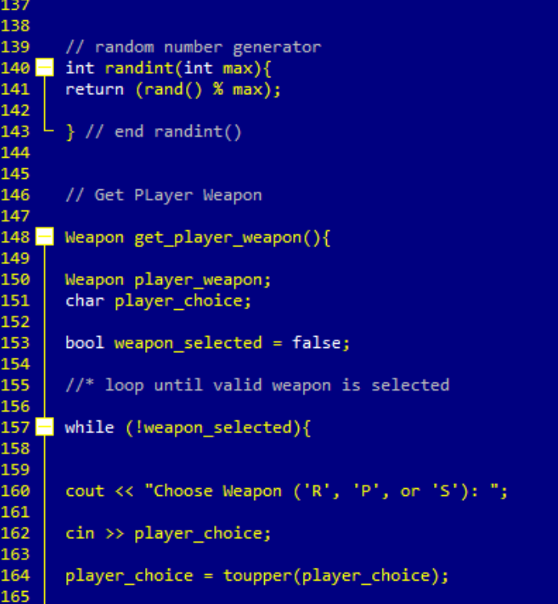

# RockPaperScissors
Simplistic computer game based on the traditional rock paper scissors game.

## Instructions 
This is a game for two players, which you will be playing
against the computer.  With each game, both players will
select one of the following weapons: PAPER, ROCK, or SCISSORS.
The winner is determined as follows:
If both players select the same weapon, the game is a tie.
ROCK blunts SCISSORS, so the player who selects ROCK wins.
PAPER wraps ROCK, so the player who selects PAPER wins.
SCISSORS cuts PAPER, so the player who selects SCISSORS wins.
With each turn, select 'R' for ROCK, 'P' for PAPER, or 'S' for
SCISSORS, and then press ENTER.  You may quit at any time.

## How This Program Works
This program works by allowing the user to choose one of three options, rock, paper, or scissors. The computer will use the random funcion to choose its weapon. This program runs on a loop, so at the end of every game the user is asked if they would like to play again.

## Installation
Can be compiled in DEV-C.

